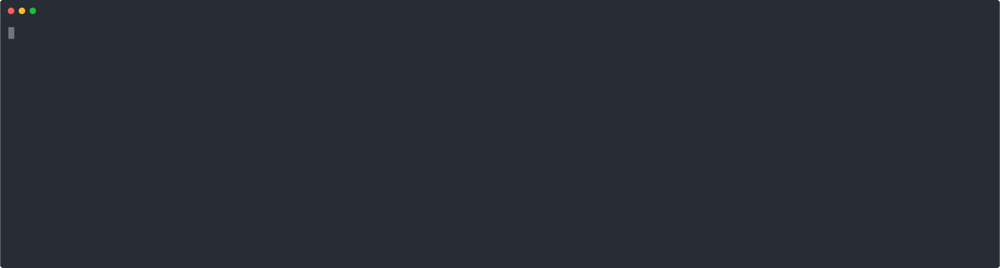
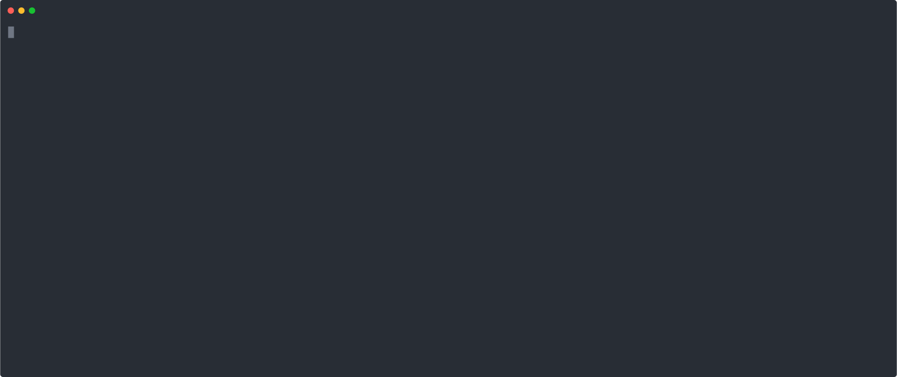

### myvmw : CLI for my.vmware.com
myvmw is a CLI client used to login and interact with the my.vmware.com website.  
Allows for programmatic query and download of VMware product binaries.  
Built as a docker container

#### Use:
**Note:** Shell installation is OPTIONAL - if you prefer to use native docker commands you may also use the syntax at the end of this help.

**Download and execute the `myvmw` installer (follow prompts)**
<pre>
docker pull apnex/myvmw
docker run apnex/myvmw install > install.sh
chmod 755 install.sh
./install.sh
</pre>

`insert terminal animation`

### myvmw CLI client BASH/ZSH installation process ###
1) Install myvmw CLI client - issue the commands below in a new terminal window  
-- This will download the container from my public dockerhub account and run it  
-- Re-run these install steps at any time if you wish to change credentials or download directory  
-- Default download directory is ~/vmwfiles and the install will create a credentials file called ~/vmwfiles/config.json  
-- Only BASH or ZSH terminals currently supported for SHELL installation  

#### 2: Run the myvmw client
<pre>
myvmw
</pre>

This will log in to my.vmware.com and list the available product categories

#### 3: Command syntax examples
**view this help again**
<pre>
myvmw help
</pre>

**index and view all product categories**
<pre>
myvmw
</pre>


**view available files in a specific category (note use of double-quotes)**
```
myvmw "<category>"
```

**download a file (you'll need permissions on my.vmware to do this, as shown by a 'yes' in the 'download' column)**
```
myvmw get <filename>
```

**view files under "VMware NSX-T" category**
```
myvmw "VMware NSX-T"
```


**download NSX-T Manager OVA**
```
myvmw get nsx-unified-appliance-2.0.0.0.0.6522097.ova
```

#### Manually running the docker container (no SHELL integration)
1) Create a new empty local directory, ie 'mkdir vmwfiles' - this will be used for file downloads.  
2) Create a new file 'config.json' in 'vmwfiles' directory above with the following structure (replace credentials with your own):
```json
{
	"username": "username@domain.com",
	"password": "password"
}
```
3) Run the docker container while mounting the local vmwfiles dir into the container as /vmwfiles
```
docker run --net host -v <LOCALVMWDIR>:/vmwfiles apnex/myvmw
```
